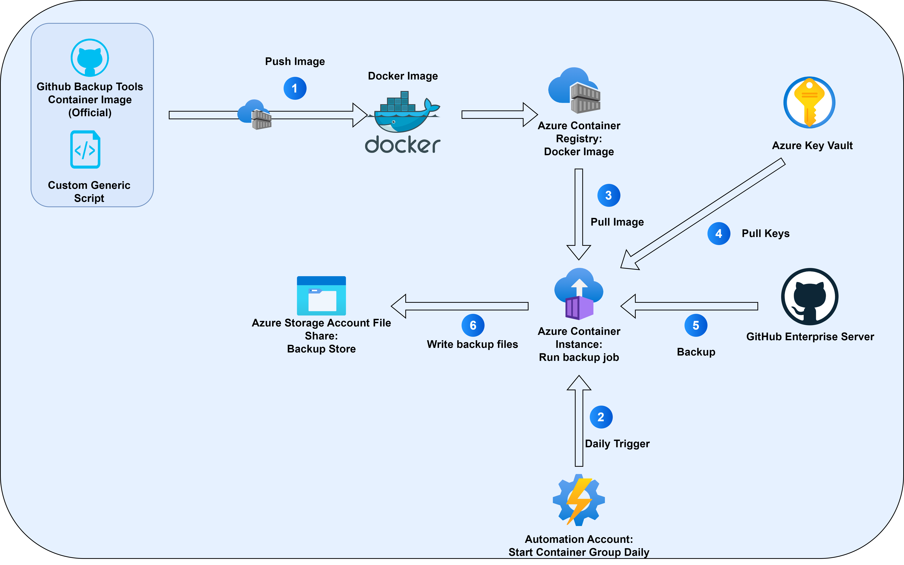

# Azure-Based GitHub Enterprise Server Backup and Restore

> This is a friendly view of the README, The full repo is here: [GitHub](https://github.com/humanascode/GitHub-Enterprise-Server-Backup-Azure)

This repo contains the scripts and methods to configure a backup and restore process for GitHub Enterprise Server using Azure Container Instances and Azure Files.
It provides a serverless solution to backup and restore GitHub Enterprise Server instances Which is cost-effective and easy to manage and upgrade.

The solution is based on the [GitHub Enterprise Server Backup Utilities](https://github.com/github/backup-utils) and uses GitHub's Docker image to run the backup and restore scripts. It utilizes Azure Container Instances to run the backup and restore scripts and Azure Files to store the backups as well as Azure Automation to schedule the backups.

The Github Enterprise Server Can be deployed On Azure VMs, On-Premises, or in any other cloud provider. This solution works as long as the Azure Container Instance has line of sight (network connectivity) to the GitHub Enterprise Server instance.

## Why use this solution?
When i approached the task of backing up GitHub Enterprise Server, I first thought of using Azure Backup to backup the entire VM. However, this solution is not the best practice from GitHub's perspective. The GitHub appliance contains elements (such as databases) that need to be backed up in a certain way. Since the GitHub Enterprise Server is somewhat of a "BlackBox", It cannot accept standard Azure Backup extensions.  
The other reason i came up with this solution is that i didnt want to use a VM to run the backup process. I wanted a serverless solution that doesnt require a lot of maintance overhead.

Here is a high-level drawing of the architecture:

## How it works

1. An azure automation account triggers the backup process by starting an Azure Container Instance. This happens on a configurable schedule.
2. The Azure Container Instance pulls the image from the Azure Container Registry and runs it. It then pulls the required keys from the Azure Key Vault.
3. The backup script runs and creates a full backup of the GitHub Enterprise Server instance.
4. The backup is Archived and uploaded to Azure Files.
> **Why is the backup Tarred?** Well, Azure files SMB file shares dont support Linux-style symbolice links, So we cant use the mounted volume to store the backup. Instead, the backup is saved locally in the container and then tarred and uploaded to Azure Files.  
> **Why Azure Files Then?** Azure Files is currently the only supported volume type for Azure Container Instances. Instaed of giving up on the idea of using Azure Container Instances, we can use Azure Files to store the backup in an archived format.

## Prerequisites
All of the commands in this guide are made with Azure CLI. You can install it by following the instructions [here](https://docs.microsoft.com/en-us/cli/azure/install-azure-cli).
A linux clinet is required to build the docker image. If you are working on Windows you can use [WSL](https://docs.microsoft.com/en-us/windows/wsl/install).

## Limitations
- Azure Container Instance currently comes with a 50GB storage size. Since each run of the backup process creates one full backup, the storage size should be enough to create the backup locally before copying it to Azure Files. If the backup size exceeds 50GB, the backup process will fail.
- The backup process is not incremental. Each run of the backup process creates a full backup.

## Start Here!
Follow [Backup](./Backup/README.md) for a step-by-step guide on how to configure the backup process.  
Follow [Restore](./Restore/README.md) for a step-by-step guide on how to configure the restore process.

## Links
[GitHub Enterprise Server Backup Utilities](https://github.com/github/backup-utils)  
[Azure Container Instances](https://learn.microsoft.com/en-us/azure/container-instances/)  
[Azure Files](https://learn.microsoft.com/en-us/azure/storage/files/)  
[Azure Automation](https://learn.microsoft.com/en-us/azure/automation/)  
[Azure Container Registry](https://learn.microsoft.com/en-us/azure/container-registry/)  

## Contributing
This project welcomes contributions and suggestions! Please feel free to raise an issue or create a pull request.

## License
This project is licensed under the MIT License - see the [LICENSE](./LICENSE) file for details.

## Disclaimer
This project is not officially supported by GitHub. It is a community project that aims to provide a cost-effective and easy-to-use solution for backing up and restoring GitHub Enterprise Server instances on Azure. It is provided as-is and without any warranty. Always test the backup and restore process before using it in a production environment.

